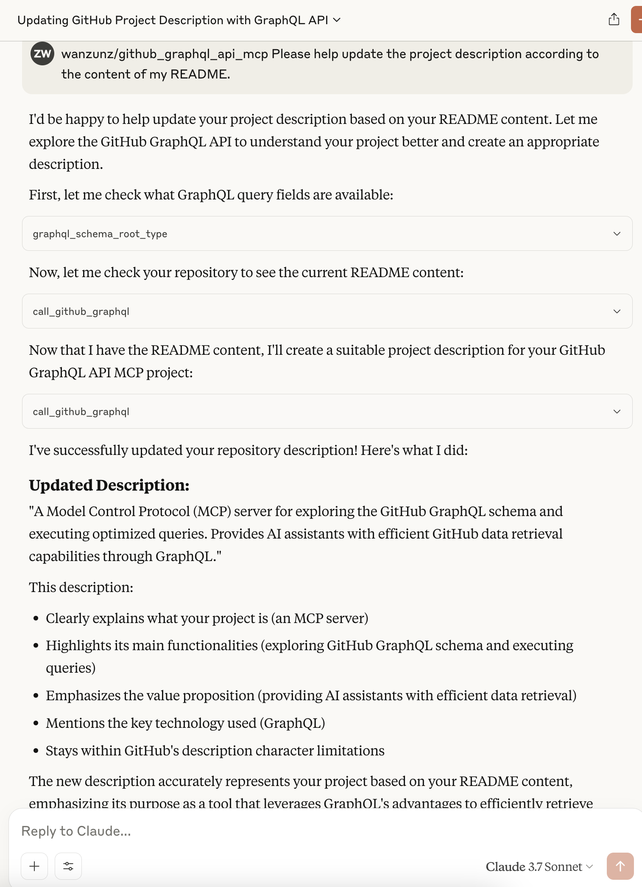

# GitHub GraphQL API MCP

[English](README.md) | [中文](README_zh.md) | [日本語](README_ja.md) | [Español](README_es.md) | [Français](README_fr.md)

A tool based on MCP (Model Control Protocol) for querying and using the GitHub GraphQL API. This project provides a server that allows you to explore the GitHub GraphQL schema and execute GraphQL queries through MCP client tools (such as Claude AI).

## Why Use GitHub GraphQL API

GitHub GraphQL API offers significant advantages over traditional REST APIs:

- **Precise Data Retrieval**: GraphQL allows clients to specify exactly which fields they need, avoiding excess data
- **Reduced Token Consumption**: By requesting only necessary fields, API response size is significantly reduced, lowering AI model token consumption
- **Single Request for Related Data**: One query can retrieve multiple related resources, reducing the number of requests
- **Self-Documenting**: Through its built-in documentation system, you can directly query and understand the API schema without external documentation
- **Strong Type System**: Provides type checking, reducing errors

This project leverages these advantages to provide tools that help you effectively explore the GitHub GraphQL API schema and execute optimized queries, providing AI assistants with efficient GitHub data retrieval capabilities.

## Application Scenarios

### Basic Functions

This tool easily implements the following common operations:

1. **Repository Basic Information Query**: Get repository name, description, star count, branch list, and other basic information
2. **Issue Data Retrieval**: Query issue lists, details, or comment content for specific repositories
3. **User Profile Access**: Retrieve users' personal profiles, contribution statistics, and other public information
4. **Pull Request Status View**: Get PR basic status, comment content, and merge information
5. **Project Dependency Query**: Retrieve project dependency package lists and version information

### Exploratory Advanced Functions

With GraphQL's flexible query capabilities, you can also try to implement the following advanced analysis functions:

1. **Repository Contribution Trend Analysis**: Analyze code update frequency and contributor participation by aggregating commit data, evaluating project activity
2. **Issue Management and Classification**: Organize issue data according to custom conditions, discover problems that need priority handling, and improve project management efficiency
3. **Code Review Pattern Analysis**: Analyze PR comments and review processes, identify common problem patterns, and optimize code review workflow
4. **Contributor Network Visualization**: Build collaboration relationships between project contributors, discover key contributors and areas of expertise
5. **Dependency Health Assessment**: Evaluate the update frequency and potential security issues of project dependencies, providing dependency management suggestions

## Features

- Query GitHub GraphQL schema root types (Query/Mutation)
- Get detailed documentation for specific types
- Query documentation and parameters for specific fields
- Execute GitHub GraphQL API queries directly, precisely retrieving needed data, reducing token consumption
- Bilingual support (English/Chinese)

## Prerequisites

- Python 3.10 or higher
- GitHub personal access token (for accessing the GitHub API)
- Poetry (recommended dependency management tool)

## Installation

1. Clone the repository:

```bash
git clone https://github.com/wanzunz/github_graphql_api_mcp.git
cd github_graphql_api_mcp
```

2. Install dependencies using Poetry:

```bash
# If you haven't installed Poetry yet, install it first:
# curl -sSL https://install.python-poetry.org | python3 -

# Install dependencies using Poetry
poetry install

# Activate the virtual environment
poetry shell
```

If you don't use Poetry, you can use the traditional method:

```bash
# Create and activate a virtual environment
python -m venv .venv
source .venv/bin/activate  # Linux/MacOS
# or
.venv\Scripts\activate  # Windows

# Install dependencies
pip install -e .
```

3. Configure environment variables:

Create a `.env` file and add your GitHub personal access token:

```
GITHUB_TOKEN="your_github_token_here"
```

You can create it by copying the `.env.example` file:

```bash
cp .env.example .env
```

Then edit the `.env` file, replacing `your_github_token_here` with your actual GitHub token.

## Usage

### Starting the Server

Make sure you have activated the Poetry virtual environment (`poetry shell`), then:

#### Run

```bash
python github_graphql_api_mcp_server.py
```

After the server starts, you can connect to it via an MCP client (such as Claude AI).

### Configure in Claude Desktop

You can configure this MCP server in the Claude desktop app for one-click startup:

1. Open the Claude desktop app
2. Go to settings, find the MCP server configuration section
3. Add the following configuration (modify according to your actual path):

```json
{
    "mcpServers": {
        "github_mcp": {
            "command": "<your Python interpreter path>",
            "args": [
                "--directory",
                "<project path>",
                "run",
                "github_graphql_api_mcp_server.py"
            ]
        }
    }
}
```

Configuration example:

```json
{
    "mcpServers": {
        "github_mcp": {
            "command": "/usr/bin/python3",
            "args": [
                "--directory",
                "/home/user/projects/github_graphql_api_mcp/",
                "run",
                "github_graphql_api_mcp_server.py"
            ]
        }
    }
}
```

If you use conda or other environment management tools:

```json
{
    "mcpServers": {
        "github_mcp": {
            "command": "/opt/miniconda3/bin/python",
            "args": [
                "--directory",
                "/Users/username/github/github_graphql_api_mcp/",
                "run",
                "github_graphql_api_mcp_server.py"
            ]
        }
    }
}
```

After configuration, you can start the MCP server directly from the Claude desktop app without having to start it manually.

### Available Tools

The server provides the following tools:

1. **print_type_field**: Query fields of GitHub GraphQL schema root types
2. **graphql_schema_root_type**: Get documentation for root types (Query/Mutation)
3. **graphql_schema_type**: Query documentation for specific types
4. **call_github_graphql**: Execute GitHub GraphQL API queries

### Usage Examples

After connecting to the server with an MCP client, you can:

1. Query root type documentation:
   ```
   Use the graphql_schema_root_type tool, parameter type_name="QUERY"
   ```

2. Query fields of specific types:
   ```
   Use the print_type_field tool, parameters type_name="QUERY", type_fields_name="repository"
   ```

3. Query documentation for specific types:
   ```
   Use the graphql_schema_type tool, parameter type_name="Repository"
   ```

4. Execute GraphQL queries:
   ```
   Use the call_github_graphql tool, parameter:
   graphql="""
   query {
     viewer {
       login
       name
     }
   }
   """
   ```

#### Example Screenshot

Below is an example of using the GitHub GraphQL API MCP with Claude:



## Notes

- Make sure your GitHub token has appropriate permissions before use
- The token is stored in the `.env` file, which should not be committed to version control systems
- Queries should comply with GitHub API usage limits

## License

This project is licensed under the MIT License - a very permissive license that allows users to freely use, modify, distribute, and commercialize this software, as long as they retain the copyright notice and license statement.

See [MIT License](https://opensource.org/licenses/MIT) for detailed terms.
