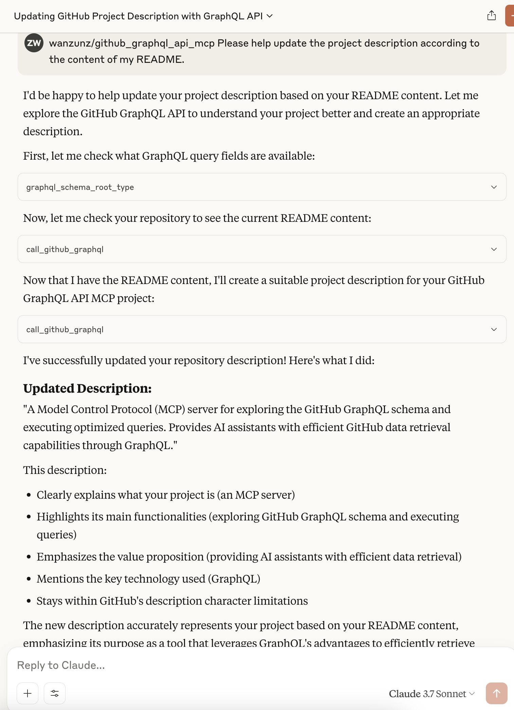

# GitHub GraphQL API MCP

[English](README.md) | [中文](README_zh.md) | [日本語](README_ja.md) | [Español](README_es.md) | [Français](README_fr.md)

这是一个基于 MCP (Model Context Protocol) 的工具，用于查询和使用 GitHub GraphQL API。项目提供了一个服务器，允许你通过 MCP 客户端工具（如 Claude AI）探索 GitHub GraphQL 架构并执行 GraphQL 查询。

## 目录

- [为什么使用 GitHub GraphQL API](#为什么使用-github-graphql-api)
- [应用场景](#应用场景)
- [特性](#特性)
- [与官方 GitHub MCP Server 的对比](#与官方-github-mcp-server-的对比)
- [前提条件](#前提条件)
- [安装](#安装)
- [使用方法](#使用方法)
- [注意事项](#注意事项)
- [许可证](#许可证)

## 为什么使用 GitHub GraphQL API

GitHub GraphQL API 相比传统 REST API 具有显著优势：

- **精确获取所需数据**：GraphQL 允许客户端精确指定需要的字段，避免获取多余数据
- **减少 Token 消耗**：通过只请求必要字段，可以显著减少 API 响应大小，从而降低 AI 模型的 Token 消耗
- **单次请求获取关联数据**：一次查询可以获取多个相关资源，减少请求次数
- **自我文档化**：通过内置的文档系统，可以直接查询和了解 API 架构，无需外部文档
- **强类型系统**：提供类型检查，减少错误

本项目充分利用这些优势，提供工具帮助你有效地探索 GitHub GraphQL API 架构并执行优化的查询，为 AI 助手提供高效的 GitHub 数据获取能力。

## 应用场景

### 基础功能

本工具可以轻松实现以下常见操作：

1. **仓库基本信息查询**：获取仓库名称、描述、星标数、分支列表等基本信息
2. **议题数据检索**：查询特定仓库的议题列表、详情或评论内容
3. **用户资料获取**：检索用户的个人资料、贡献统计等公开信息
4. **Pull Request 状态查看**：获取 PR 的基本状态、评论内容和合并信息
5. **项目依赖查询**：检索项目的依赖包清单及版本信息

### 探索性高级功能

借助 GraphQL 的灵活查询能力，你还可以尝试实现以下高级分析功能：

1. **仓库贡献趋势分析**：通过聚合提交数据，分析代码更新频率和贡献者参与度，评估项目活跃度
2. **议题管理与分类**：根据自定义条件组织议题数据，发现需要优先处理的问题，提升项目管理效率
3. **代码审查模式分析**：分析 PR 评论和审查过程，识别常见问题模式，优化代码审查流程
4. **贡献者网络可视化**：构建项目贡献者之间的协作关系，发现关键贡献者和专长领域
5. **依赖健康状况评估**：评估项目依赖的更新频率和潜在安全问题，提供依赖管理建议

## 特性

- 查询 GitHub GraphQL 架构的根类型（Query/Mutation）
- 获取特定类型的详细文档
- 查询特定字段的文档和参数
- 直接执行 GitHub GraphQL API 查询，精确获取所需数据，减少 Token 消耗
- 多语言支持（英语/中文/日语/西班牙语/法语）

## 与官方 GitHub MCP Server 的对比

相较于官方的 [github-mcp-server](https://github.com/github/github-mcp-server)，本项目在特定场景下具有显著优势：

| 特性 | GitHub GraphQL API MCP | 官方 GitHub MCP Server |
|------|------------------------|------------------------|
| **核心机制** | 单一 GraphQL 查询 | 多个 REST API / 细粒度工具 |
| **数据获取** | **一次性完成**：单次请求即可获取仓库详情、Issue、PR、提交历史和发布版本 | **多步骤**：需要串行调用 `search_repositories`, `get_file_contents`, `list_commits` 等多个工具 |
| **效率** | 高。极大减少网络延迟和交互往返次数。 | 在复杂数据获取时较低。多次串行工具调用导致高延迟。 |
| **Token 消耗** | **优化**。仅返回请求的字段。 | **较高**。中间步骤的工具输出（完整的 JSON 响应）会占用上下文窗口。 |
| **灵活性** | **极高**。客户端定义所需的确切数据结构。 | **固定**。客户端必须处理预定义的 API 响应结构。 |
| **API 覆盖范围** | **完整**。可访问 GitHub GraphQL API 暴露的所有数据和功能。 | **有限**。仅限于维护者手动封装和暴露的特定 REST 端点。 |
| **自我内省** | **支持**。AI 可通过工具查询 API 定义，自主学习并适应新功能。 | **不支持**。AI 只能依赖训练数据中的知识，对新推出的 API 无能为力。 |
| **维护成本** | **极低**。支持 GitHub 新功能通常只需更新 Schema 文件，无需改代码。 | **较高**。每个新功能都需要编写 Go 代码、定义结构体并重新发布版本。 |
| **复杂度** | 需要 LLM 编写 GraphQL（通过架构内省工具辅助）。 | 对偏好简单函数调用的 LLM 更友好，但需管理多次调用的上下文。 |

**示例**：要获取"某项目的最新重要更新"，本工具可以**一次性**拉取 Release 信息、最近提交和未解决 Issue，而官方 Server 可能需要 5 次以上的独立工具调用和往返交互。

### 为什么这对 AI Agent 很重要？

1.  **上下文窗口效率**：官方工具通常返回巨大的 JSON 对象（例如，一个完整的仓库对象可能超过 5KB）。使用 GraphQL，你可以只获取 `name` 和 `description`，节省 99% 的 Token。这对于长对话和复杂任务至关重要。
2.  **复杂推理能力**：AI Agent 经常需要遍历数据关系（例如"找到关闭了这个 Issue 的 PR 的作者"）。在 REST/官方工具中，这是一个"搜索 -> 获取 ID -> 获取 PR -> 获取作者"的多步过程，容易出错且耗时。在 GraphQL 中，这是一个单一的嵌套查询，让 AI 可以专注于逻辑推理而不是数据搬运。
3.  **未来适应性**：当 GitHub 添加新功能（例如在 Discussions 上添加新字段）时，本 MCP Server 可以通过 Schema 内省立即支持，而官方 Server 则需要等待代码更新和发版。

## 前提条件

- Python 3.10 或更高版本
- GitHub 个人访问令牌（用于访问 GitHub API）
- Poetry（推荐的依赖管理工具）

## 安装

1. 克隆项目仓库：

```bash
git clone https://github.com/wanzunz/github_graphql_api_mcp.git
cd github_graphql_api_mcp
```

2. 使用 Poetry 安装依赖：

```bash
# 如果你还没有安装 Poetry，请先安装：
# curl -sSL https://install.python-poetry.org | python3 -

# 使用 Poetry 安装依赖
poetry install

# 激活虚拟环境
poetry shell
```

如果你不使用 Poetry，也可以使用传统方式：

```bash
# 创建并激活虚拟环境
python -m venv .venv
source .venv/bin/activate  # Linux/MacOS
# 或
.venv\Scripts\activate  # Windows

# 安装依赖
pip install -r requirements.txt
```

3. 配置环境变量：

创建 `.env` 文件并添加你的 GitHub 个人访问令牌：

```
GITHUB_TOKEN="your_github_token_here"
```

你可以通过复制 `.env.example` 文件来创建：

```bash
cp .env.example .env
```

然后编辑 `.env` 文件，将 `your_github_token_here` 替换为你的实际 GitHub 令牌。

## 使用方法

### 启动服务器

确保你已激活 Poetry 虚拟环境（`poetry shell`），然后：

#### 运行

```bash
python github_graphql_api_mcp_server.py
```

服务器启动后，你可以通过 MCP 客户端（如 Claude AI）连接到它。

### 在 Claude 桌面端配置

你可以在 Claude 桌面端中配置此 MCP 服务器，实现一键启动：

1. 打开 Claude 桌面端
2. 进入设置，找到 MCP 服务器配置部分
3. 添加以下配置（根据你的实际路径修改）：

```json
{
    "mcpServers": {
        "github_mcp": {
            "command": "/path/to/uv",
            "args": [
                "run",
                "--directory",
                "<项目路径>",
                "github_graphql_api_mcp_server.py"
            ]
        }
    }
}
```

配置示例（使用 uv）：

```json
{
    "mcpServers": {
        "github_mcp": {
            "command": "/Users/username/.cargo/bin/uv",
            "args": [
                "run",
                "--directory",
                "/Users/username/github/github_graphql_api_mcp/",
                "github_graphql_api_mcp_server.py"
            ]
        }
    }
}
```

如果使用标准 Python（方法二）：

```json
{
    "mcpServers": {
        "github_mcp": {
            "command": "/path/to/project/.venv/bin/python",
            "args": [
                "github_graphql_api_mcp_server.py"
            ]
        }
    }
}
```

配置完成后，你可以直接从 Claude 桌面端启动 MCP 服务器，无需手动启动。

### 可用工具

服务器提供以下工具：

1. **print_type_field**：查询 GitHub GraphQL 架构根类型的字段
2. **graphql_schema_root_type**：获取根类型（Query/Mutation）的文档
3. **graphql_schema_type**：查询特定类型的文档
4. **call_github_graphql**：执行 GitHub GraphQL API 查询

### 使用示例

使用 MCP 客户端连接到服务器后，你可以：

1. 查询根类型文档：
   ```
   使用 graphql_schema_root_type 工具，参数 type_name="QUERY"
   ```

2. 查询特定类型的字段：
   ```
   使用 print_type_field 工具，参数 type_name="QUERY", type_fields_name="repository"
   ```

3. 查询特定类型的文档：
   ```
   使用 graphql_schema_type 工具，参数 type_name="Repository"
   ```

4. 执行 GraphQL 查询：
   ```
   使用 call_github_graphql 工具，参数：
   graphql="""
   query {
     viewer {
       login
       name
     }
   }
   """
   ```

#### 示例截图

以下是使用 GitHub GraphQL API MCP 与 Claude 交互的示例：



## 注意事项

- 使用前请确保你的 GitHub 令牌具有适当的权限
- 令牌存储在 `.env` 文件中，该文件不应该被提交到版本控制系统中
- 查询时应遵循 GitHub API 的使用限制

## 许可证

本项目采用 MIT 许可证 - 这是一个非常宽松的许可证，允许用户自由地使用、修改、分发和商业化本软件，只需保留版权声明和许可证声明即可。

详细条款请参见 [MIT 许可证](https://opensource.org/licenses/MIT)。 